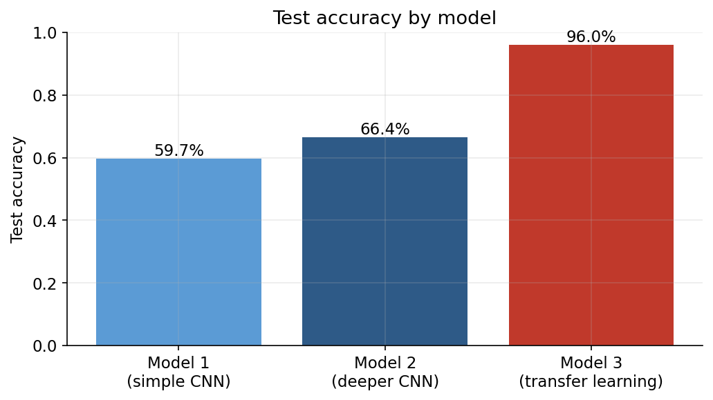
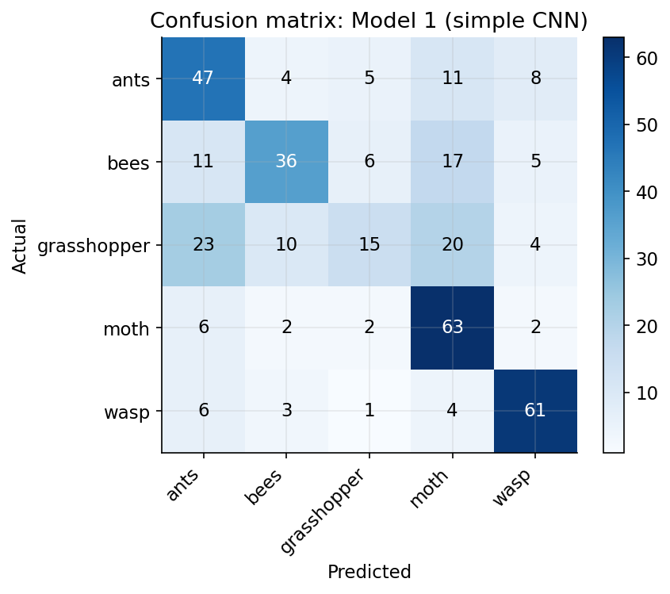
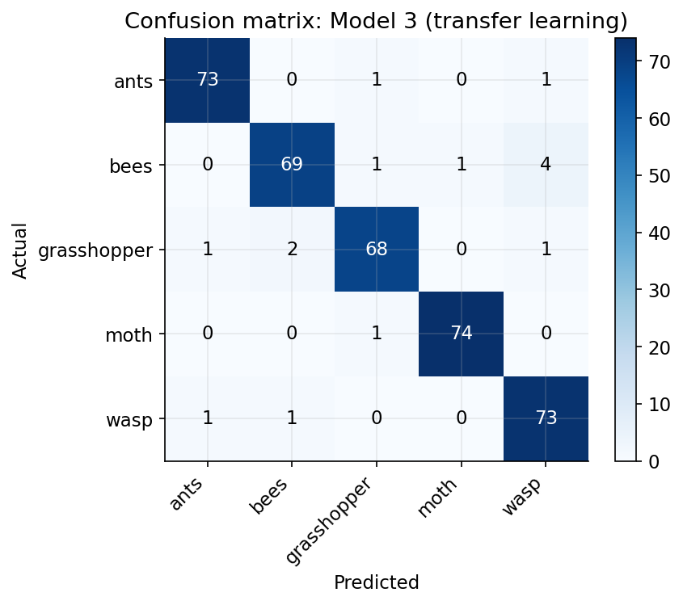

# Agricultural Pest Image Classification

Classifying images of five agricultural pests, ants, bees, grasshoppers, moths, and wasps, and testing how far a small image dataset (about 2,500 photos) can be pushed with different approaches: a simple convolutional network, a deeper one, and a network built on top of pretrained weights.

This project started as a university assignment on applied AI for business and has since been reworked: a scoring bug in the original comparison is fixed, the split between training, validation, and test data is done properly, and a transfer learning model is added to see what a small dataset like this can actually achieve.

## Dataset

2,475 images across five pest classes, roughly balanced (484 to 500 images per class): ants, bees, grasshoppers, moths, and wasps. Each image is resized to 128 by 128 pixels before training.

## What changed from the original coursework version

- **A scoring bug.** The original notebook trained two models and reported a Cohen's Kappa score for each, claiming the second, deeper model scored slightly higher. Looking closely at the code, the kappa calculation for the second model reused the first model's predicted labels by mistake (`y_pred_classes` instead of `y_pred_classes_2`), so the reported "improvement" for model two was actually model one's score printed a second time. This version computes each model's metrics from its own predictions.
- **No dedicated validation set.** The original split the data into training and test sets only, then used part of the training set for validation during each training run, meaning the validation carved out of it changed depending on how training was configured. This version fixes one stratified split up front, 70% train, 15% validation, 15% test, so every model is judged against the exact same held out data.
- **A fixed training length with no overfitting check.** Both original models trained for a flat 100 epochs regardless of what was happening to validation loss. This version adds early stopping, restoring the weights that performed best on the validation set rather than whatever the model looked like after the full epoch count.

## Method

1. **Exploration.** Load all images, confirm the class balance, and look at a sample.
2. **Model 1: simple CNN.** Three convolutional and pooling layers followed by a dense classifier, trained from scratch. This mirrors the original assignment's first model.
3. **Model 2: deeper CNN.** More convolutional filters, two dense layers, and dropout for regularization, also trained from scratch, mirroring the original's second model.
4. **Model 3: transfer learning.** A MobileNetV2 backbone pretrained on ImageNet, frozen, with a small trainable classification head on top and light data augmentation (flips, rotation, zoom) during training.
5. **Evaluation.** Test accuracy, Cohen's Kappa, and F1 score for each class, for all three models on the same held out test set.

## Findings

**Transfer learning is not a close contest here, it wins by a wide margin.** The simple CNN reaches 59.7% test accuracy, the deeper CNN improves on that at 66.4%, and the transfer learning model reaches 95.7%. Cohen's Kappa, which corrects for the chance a model gets right by guessing, tells the same story: 0.50 and 0.58 for the two models trained from scratch against 0.95 for transfer learning.



**The models trained from scratch genuinely struggle to tell grasshoppers apart from other classes.** Grasshopper has the lowest F1 score for both of them (0.30 for the simple CNN, 0.44 for the deeper one), and the confusion matrix shows why: almost a third of grasshopper images get misclassified as ants. The transfer learning model has no such problem, its grasshopper F1 is 0.95, on par with every other class.



**A deeper architecture helps a little, pretraining helps enormously.** Going from the simple CNN to the deeper one improved accuracy by about seven points. Adding pretrained weights improved it by roughly thirty. With only around 1,700 training images per model, a network starting from scratch has to learn what an edge, a texture, and a shape are from that data alone, while a network pretrained on millions of general images already knows those things and only needs to learn what separates a wasp from a bee.



## What this means in practice

For a genuinely small, specialized image dataset like this one, the honest recommendation is to reach for transfer learning first rather than treating it as an optional upgrade. Training a CNN from scratch is a reasonable exercise for understanding how convolutional networks work, but on this evidence it isn't the right default for a real pest identification tool with a dataset this size. The gap here, roughly 30 accuracy points, is large enough that it should shape which approach gets built for an actual deployment, not just which one gets mentioned as a possible improvement.

## Repo structure

```
agricultural-pest-classification/
├── analysis.py           # end to end analysis, produces figures/ and results.json
├── notebook.ipynb         # same analysis as a runnable notebook
├── requirements.txt
├── data/                  # pest images, one folder per class
├── figures/               # generated charts
└── results.json           # raw numbers behind every claim above
```

## Running it

```bash
python3 -m venv .venv
source .venv/bin/activate
pip install -r requirements.txt
python analysis.py
```

## Limitations

Both models trained from scratch could likely close some of the gap with more aggressive data augmentation, longer training schedules, or a larger dataset, none of which were tried here since the point was to compare a reasonable version of each approach rather than to squeeze the last few points out of any one of them. The transfer learning model's backbone stays frozen throughout; unfreezing the top layers of MobileNetV2 to fine tune them is a natural next step and would likely push accuracy higher still, at the cost of longer training and more risk of overfitting on a dataset this size.
