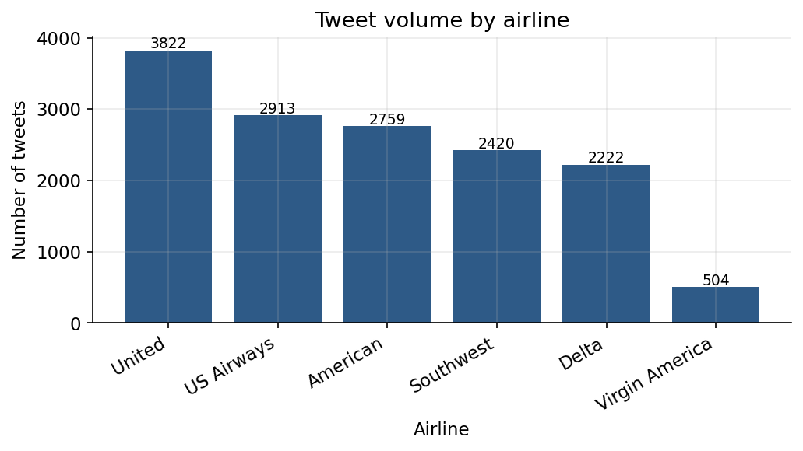
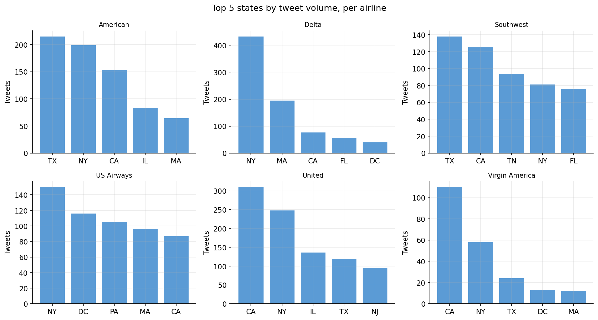
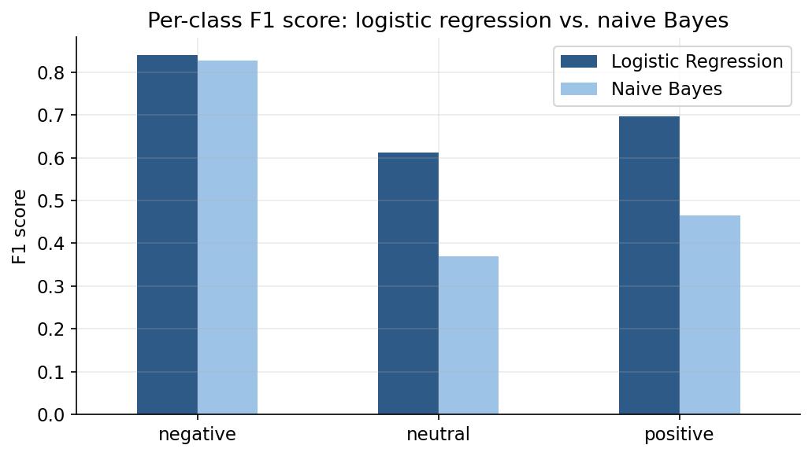
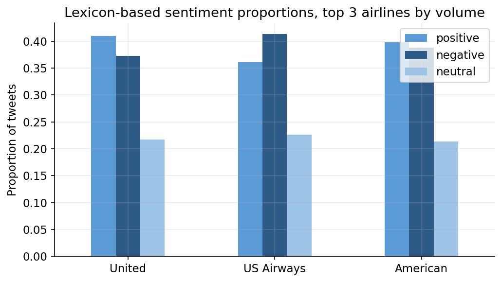
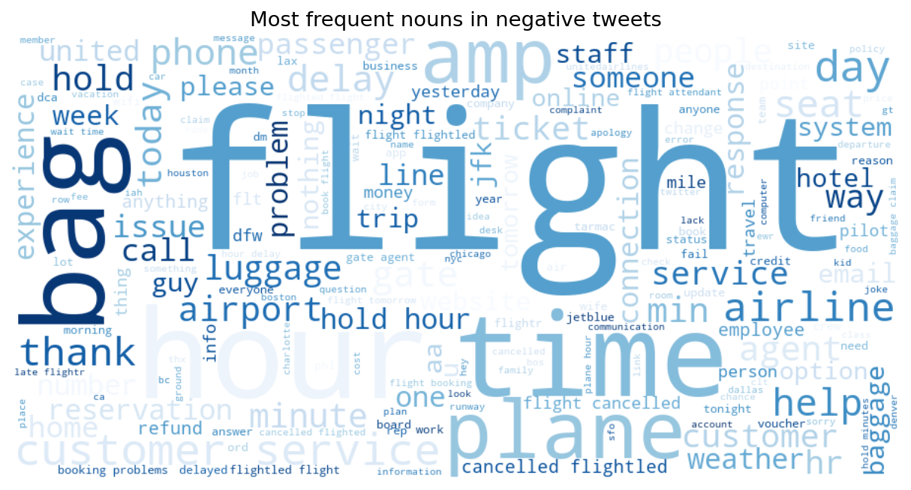

# Airline Tweet Sentiment and Topic Analysis

A study of the Twitter US Airline Sentiment dataset, looking at which airlines get talked about most, where their customers tweet from, how well sentiment can be predicted from text, and what people are actually complaining about.

This project started as a university assignment on applied AI for business and has since been reworked: a couple of methodology issues in the original version are fixed here, the code is cleaned up and made runnable outside Google Colab, and the writeup and charts are redone from scratch.

## Dataset

14,640 tweets directed at six US airlines (United, US Airways, American, Southwest, Delta, Virgin America), originally collected by Crowdflower and widely known as the [Twitter US Airline Sentiment dataset](https://www.kaggle.com/datasets/crowdflower/twitter-airline-sentiment) on Kaggle. Each tweet carries a sentiment label (positive, neutral, negative) and, for negative tweets, a stated reason such as a late flight or lost luggage.

## What changed from the original coursework version

Two problems in the original analysis were worth fixing rather than just rewriting around:

- **Row count.** The original report stated 219,600 records. That number is `DataFrame.size`, which counts every cell across all columns, not rows. The dataset actually holds 14,640 tweets across 15 columns; 14,640 × 15 = 219,600. This version reports the row count directly.
- **State matching.** The original code tagged a tweet's state by checking whether a two letter abbreviation appeared anywhere inside the location string, for example `'IN' in tweet_location`. That matches abbreviations hiding inside unrelated words: "Orlando" contains "OR", "Miniapolis" typos contain "IN", and so on. The rework here requires the abbreviation to appear as its own word, and separately maps full state names and a set of common city names (New York City, LA, Chicago, etc.) to their state, which recovers many more genuine matches than the original substring check.
- **Sentiment labels for the predictive models.** The original code built its training label as `1 if positive else 0`, which silently folded neutral tweets in with negative ones before training. The two classifiers were therefore learning a distorted target. This version trains on all three classes as they're labeled in the data and reports precision, recall, and F1 for each class rather than a single, misleading accuracy figure.

Everything else, the general approach of comparing a predictive model against a lexicon based one, and using topic modeling to surface complaint themes, follows the same structure as the original assignment.

## Method

1. **Exploration.** Load the tweets, check for missing values, and look at how sentiment and tweet volume are distributed.
2. **Airline popularity.** Rank airlines by tweet volume as a rough proxy for how much people are talking about them online.
3. **Geography.** Extract a state from each tweet's free text location field and find the top five states per airline.
4. **Predictive sentiment.** Train logistic regression and multinomial naive Bayes on TF-IDF features to classify tweets as positive, neutral, or negative, and compare them on held out data.
5. **Lexicon based sentiment.** Score tweets with VADER, a rule based sentiment tool built for short, informal text, and compare positive versus negative proportions for the three most tweeted about airlines.
6. **Topic modeling.** Pull the nouns out of negative tweets, fit an LDA model, and visualize the resulting themes as word clouds alongside the raw complaint reason counts already present in the data.

## Findings

**United gets talked about the most, by a wide margin.** It drew 3,822 tweets, ahead of US Airways (2,913) and American (2,759). Virgin America trails everyone at 504, though that partly reflects its smaller route network rather than weaker sentiment.



**Customer geography tracks each airline's hub cities.** Delta's tweets are heavily concentrated in New York (433, more than double its next closest state), consistent with its JFK hub. United's top state is California, American and Southwest skew Texas heavy, and US Airways draws more evenly from the Northeast and mid Atlantic. About 70% of tweets with a location string could be matched to a real US state after cleanup; the rest were genuinely unparseable text like "everywhere" or emoji.



**Logistic regression clearly beats naive Bayes once the label bug is fixed.** On the corrected three class task, logistic regression reaches 76% accuracy overall, with an F1 score of 0.84 for negative tweets, 0.61 for neutral, and 0.70 for positive. Naive Bayes lands at 72% accuracy but is much weaker on the minority classes: its neutral F1 is only 0.37 and positive F1 only 0.46, despite decent precision. In practice, naive Bayes catches negative tweets aggressively (99% recall) at the cost of almost never correctly flagging a neutral or positive one. Logistic regression, helped by class weighting, is far more balanced across all three sentiments, which matters for a business trying to catch positive and neutral signal, not just complaints.



**The lexicon based scores tell a consistent story.** Among the three most tweeted about airlines, US Airways has the least favorable split (36% positive tweets versus 41% negative), while United and American each show more positive tweets than negative. This lines up with the volume ranking: the airline that gets talked about most is not necessarily the one people complain about most.



**Complaints cluster around a handful of recurring themes.** The stated complaint reasons in the data are dominated by customer service issues (2,910 tweets), late flights (1,665), and cancellations (847), with lost luggage further behind (724). Topic modeling on the free text of negative tweets, independent of that labeled reason field, surfaces the same themes from the words people actually use: long holds and phone calls, gate and boarding delays, and baggage handling.



## What this means for an airline

Two things stand out from combining the geographic and thematic findings. First, the complaint volume is dominated by operational friction, being kept waiting on the phone, delays at the gate, mishandled bags, rather than the flight experience itself, which suggests the fastest wins are in phone and gate staffing rather than in flight service redesign. Second, since customer tweets cluster around each airline's hub cities, an airline could reasonably prioritize service recovery efforts geographically rather than treating every market the same way.

## Repo structure

```
airline-tweet-sentiment-analysis/
├── analysis.py          # end to end analysis, produces figures/ and results.json
├── notebook.ipynb        # same analysis as a runnable notebook
├── requirements.txt
├── data/tweets.csv       # dataset (Crowdflower / Kaggle, public domain use)
├── figures/              # generated charts
└── results.json          # raw numbers behind every claim above
```

## Running it

```bash
python3 -m venv .venv
source .venv/bin/activate
pip install -r requirements.txt
python analysis.py
```

## Limitations

This is a single, historical dataset from one point in time (early 2015), so the findings describe that snapshot rather than airlines' current standing. The state matching still misses about 30% of tweets where the location field is unusable, and LDA topics need a human to name them (Python image files here are labeled by number, not what the topic obviously represents). Both are reasonable next steps if this were extended further, for example by weighting matches with geocoding, or choosing the number of topics by optimizing for topic coherence instead of fixing it at six.
