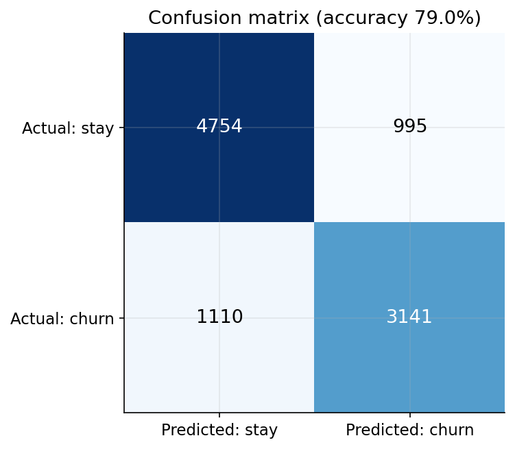
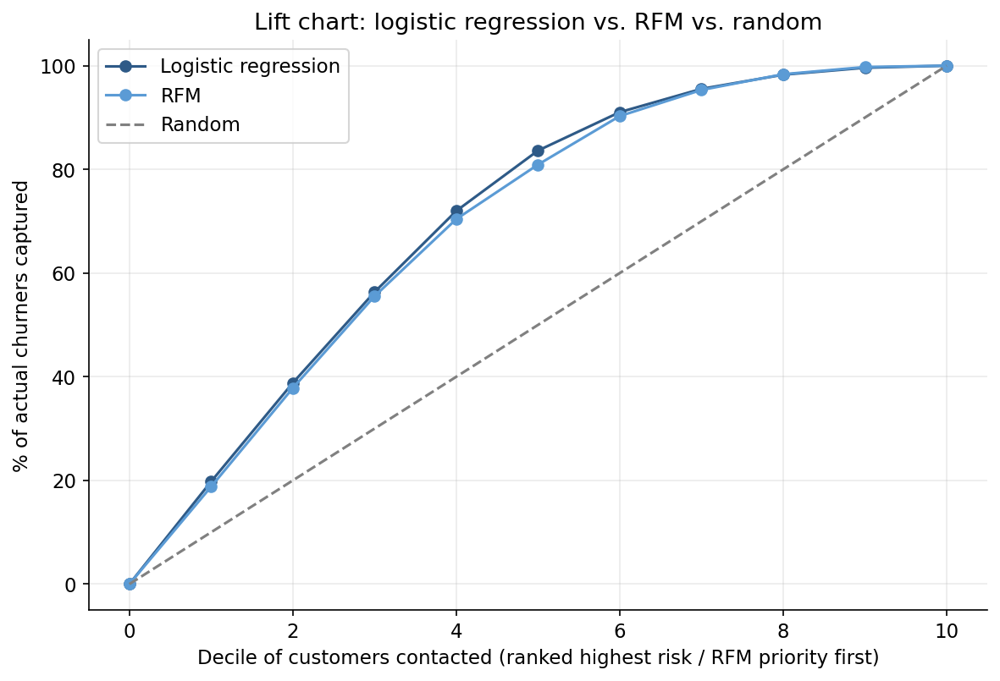

# Customer Churn: Logistic Regression vs. RFM

A Tesco Clubcard case study: 20,000 customers with a full year of purchase history are used to build a churn model, evaluated against 10,000 customers held out for testing, and compared against a simple RFM (recency, frequency, monetary) ranking and a random baseline using a lift chart.

This started as a university assignment built entirely in Excel, including a logistic regression built by hand with matrix formulas and iterative reweighting. The full analysis here is a clean rebuild in Python, and it turns up something more interesting than a simple bug fix: a real, provable defect in the original that turns out barely to have mattered, next to a mistake in my own first pass that mattered quite a bit until it was checked.

The full analysis is in [`analysis.py`](analysis.py).

## What was actually wrong with the original

The original's "Regression Model" sheet duplicates the 20,000-row training table, then builds a design matrix for the logistic fit in a set of columns alongside it. Row 3 of that design matrix, which should hold the first customer's predictors, instead pulls the literal header row: its cells show text like `"Purchase"` and `"T.last"` where numbers belong, evidence directly checkable in the workbook by comparing each row's design matrix formula (`=B1`, `=C1`, ...) against the row it should be referencing (`=B2`, `=C2`, ...). Every following row is consistently shifted down by one position: row 4 is really customer 1, row 5 is customer 2, and so on, all the way to two rows past the end of the 20,000-row table that hold real, valid calculations despite the customer ID that should anchor them being blank.

## Checking whether it actually mattered

Rather than assume how much damage that causes, this version reproduces the defect exactly and measures it. The key detail is that each shifted row still pairs a customer's own predictors with that same customer's own churn outcome, just displaced by one position. That's a much narrower defect than it might sound: it doesn't scramble which outcome belongs to which customer, it effectively drops one customer from the training set (replaced by the row derived from the header) and shifts everyone else down by one slot.

Reproducing that exact defect, training on 19,999 of the 20,000 customers instead of the full set, changes accuracy on the 10,000 customers held out for testing by **0.01 percentage points**: not something anyone would notice. For contrast, a genuinely broken version, one where each row's predictors are paired with a different customer's outcome entirely, drops accuracy from 79% to 57%, barely better than always predicting the majority class. The original's defect was real and worth fixing for correctness, but it landed nowhere near that kind of damage.

## Findings

**The corrected model performs almost identically to what the original reported**, which is itself informative: 78.95% accuracy here against the original's reported 78.84%, 73.89% sensitivity against 73.72%, 82.69% specificity against 82.62%. The alignment defect not mattering in practice is consistent with these numbers landing so close together.



**Getting RFM's ranking direction right mattered far more than the alignment defect ever did, including in this rebuild's own first attempt.** RFM is normally used to rank customers by how engaged and valuable they look, best first, which is the right ordering for identifying who to reward. Applied directly to a ranking of churn risk, that ordering is backwards: the first version of this lift chart had RFM performing *worse than random* through the first several deciles, before it was checked and the ranking reversed. The premise of using RFM for churn is that disengaged customers, not engaged ones, are the ones actually at risk, so the customers at highest risk need to come first in the ranking, not last.



**Once that direction is corrected, the original's headline claim holds up: logistic regression and RFM perform similarly, with logistic regression modestly ahead throughout.** At the fifth decile, contacting the top 50% of customers by risk captures 83.6% of actual churners using logistic regression and 80.9% using RFM, both far ahead of the 50% a random contact list would catch.

## Repo structure

```
customer-churn-rfm-comparison/
├── analysis.py       # end to end analysis, produces figures/ and results.json
├── data/
│   ├── training.csv   # 20,000 customers, observation period January to August 2015
│   └── test.csv        # 10,000 customers held out for testing, with actual churn outcomes
├── figures/            # generated charts
└── results.json        # every number behind the findings above
```

## Running it

```bash
python3 -m venv .venv
source .venv/bin/activate
pip install pandas numpy matplotlib scikit-learn
python analysis.py
```

## Limitations

Recency is derived here as `T.active - T.last` (time from a customer's last purchase to the end of the observation window), since neither variable given in the data is recency on its own; a different, equally reasonable definition might rank customers slightly differently. RFM quintiles are computed from the test set's own distribution, which is standard practice for a descriptive ranking method but means the cut points would shift somewhat on a different customer sample.
