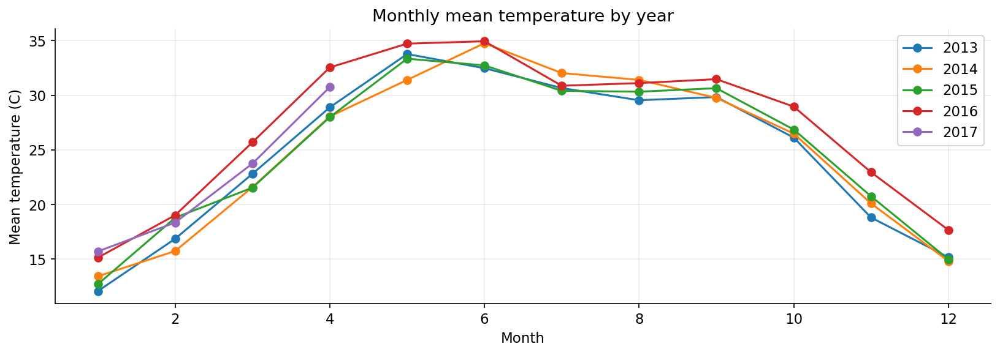
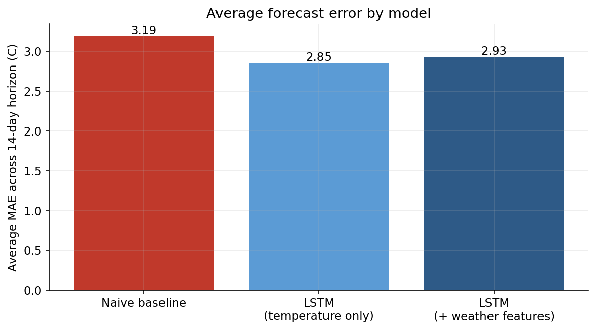
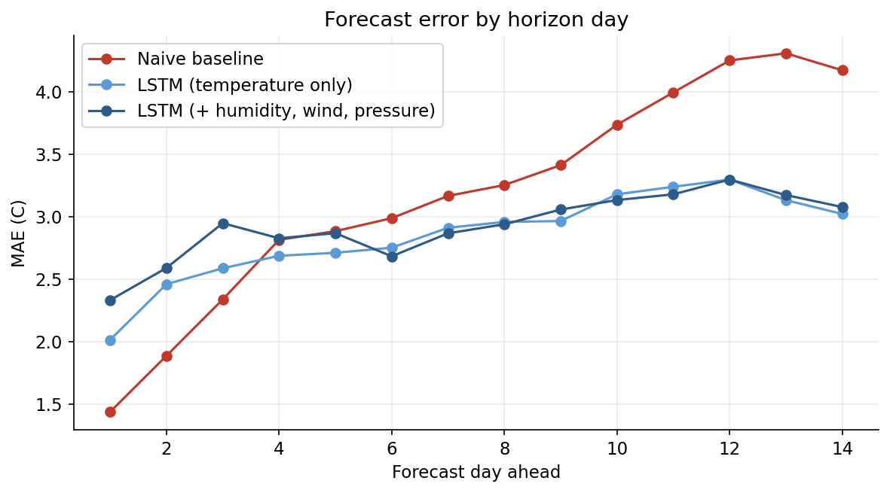
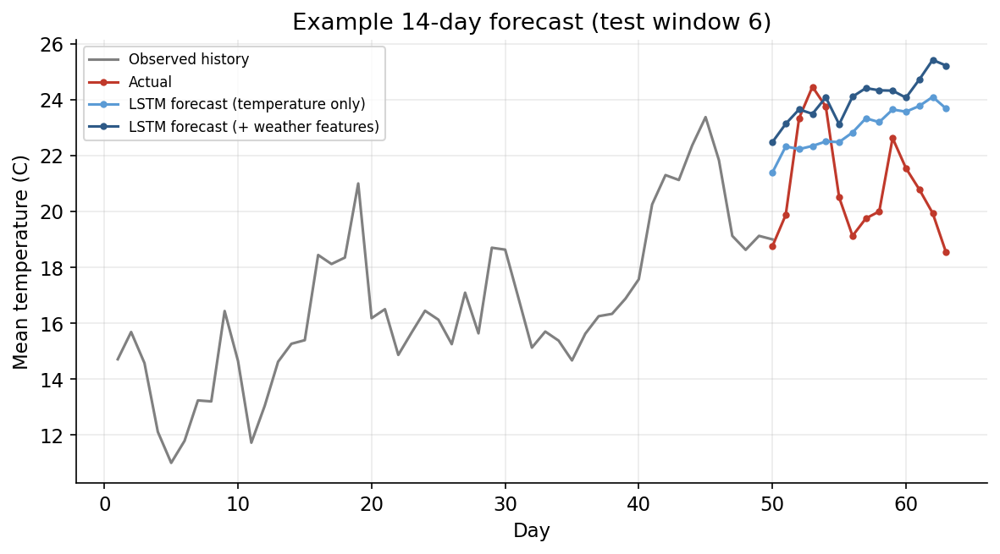

# Delhi Weather Forecasting

Forecasting Delhi's daily mean temperature 14 days ahead from four years of daily observations, and checking whether a trained model actually beats the simplest possible forecast: tomorrow will look like today.

This project started as a university assignment on applied AI for business and has since been reworked: a naive baseline and a validation split were added so the model's performance means something, a second model was built to test whether extra weather variables actually help, and the writeup and charts are redone from scratch.

## Dataset

1,575 days of weather observations for Delhi, spanning January 2013 through April 2017: daily mean temperature, humidity, wind speed, and mean pressure. No missing values. This is the daily Delhi climate dataset that circulates widely on Kaggle. 2017 is a partial year in the data (it stops in April), which matters for one of the findings below.

## What changed from the original coursework version

The original notebook trained a single LSTM on temperature alone for a fixed 100 epochs and reported its mean absolute error. Two things were missing that would matter to anyone deciding whether to actually use this model:

- **No baseline.** An MAE of 2 to 3 degrees sounds good in isolation, but there was nothing to compare it against. This version adds a naive baseline, forecast tomorrow (and every day after) as a repeat of today's temperature, which is the bar any real model needs to clear to be worth building.
- **No check against overfitting.** Training for a fixed 100 epochs with no validation signal means there's no way to tell whether the model settled into a good fit or just memorized the training years. This version holds out 10% of the training data and stops training early once validation loss stops improving.

Everything else follows the same structure as the original: same train and test split (2013 to 2016 for training, 2017 for testing), same LSTM architecture, same 14 day forecasting horizon.

## Method

1. **Exploration.** Check for missing data, plot the daily series, and compare monthly temperature patterns across years.
2. **Baseline.** A naive forecast that simply repeats the most recent observed temperature across the full 14 day horizon.
3. **Univariate LSTM.** A single LSTM layer trained on 50 days of past temperature to predict the next 14, matching the original assignment's approach, with early stopping added.
4. **Multivariate LSTM.** The same architecture, but each timestep also includes humidity, wind speed, and pressure, to test whether giving the model more to work with actually improves the forecast.
5. **Evaluation.** Mean absolute error and root mean squared error at each of the 14 forecast days, compared across all three approaches on the same held out 2017 data.

## Findings

**2016 was the warmest year in the data, consistent with the original assignment's observation.** Monthly averages peak around 33 to 35 degrees Celsius in May and June across most years, with 2016 running consistently at or above the other years for most of the calendar. 2017's data cuts off in April, so its lower yearly average reflects a partial year of cooler months, not a genuinely cooler year, and shouldn't be read as a trend.



**Both LSTM models clearly beat the naive baseline.** The naive approach, predicting no change from today, averages 3.19 degrees of error across the 14 day horizon. The univariate LSTM brings that down to 2.85 degrees, and the multivariate version to 2.93. Forecast error grows steadily further out, from around 1.4 to 2 degrees on day one to over 4 degrees by day fourteen, which is expected: two weeks is a long horizon for daily weather.



**Adding humidity, wind, and pressure did not improve the forecast.** This is worth stating plainly rather than glossing over: the multivariate model performs very slightly worse than the univariate one on average (2.93 versus 2.85 degrees MAE), and that pattern holds across most of the 14 day horizon, not just on average.



A likely explanation is that daily mean temperature is highly autocorrelated on its own, most of what a short term forecast needs is already in the recent temperature trend, and the extra variables mostly add noise and dimensionality that a single 100 unit LSTM, trained on only four years of data, doesn't have enough signal to exploit. A larger dataset, engineered features like rolling averages, or a model built specifically to weigh multiple inputs might change this, but on this data and this architecture, simpler wins.

**Both models tend to smooth over short term swings.** Looking at individual forecast windows, the actual temperature sometimes dips or spikes within the two week horizon in a way neither model anticipates; both track the general trend well but underreact to sudden day to day changes.



## What this means in practice

For short range decisions, a few days out, either LSTM is a meaningfully better planning input than assuming tomorrow looks like today, which matters for things like short term energy demand or event planning. For anything requiring day to day precision at the two week mark, the error margin (4 to 5 degrees) is large enough that these forecasts should inform ranges and risk, not exact figures. The negative result on additional features is itself a useful finding: it says the effort of collecting and engineering more weather inputs isn't automatically worth it, and would need to be tested again if the dataset grew substantially or if features were engineered more deliberately (rolling averages, lagged interactions) rather than added as raw daily values.

## Repo structure

```
delhi-weather-forecasting/
├── analysis.py           # end to end analysis, produces figures/ and results.json
├── notebook.ipynb         # same analysis as a runnable notebook
├── requirements.txt
├── data/delhi_weather.csv
├── figures/               # generated charts
└── results.json           # raw numbers behind every claim above
```

## Running it

```bash
python3 -m venv .venv
source .venv/bin/activate
pip install -r requirements.txt
python analysis.py
```

## Limitations

Four years of daily data is not a lot for a deep learning model, and the negative result on adding weather features could easily flip with more data or better engineered inputs. The naive baseline used here is the simplest reasonable one (repeat the latest value); a seasonal naive baseline (same day last year) might be a tougher comparison and is a reasonable next step. Both LSTMs also share the same single layer, 100 unit architecture carried over from the original assignment rather than tuned independently for each input configuration, so the multivariate result describes this specific architecture, not multivariate forecasting in general.
