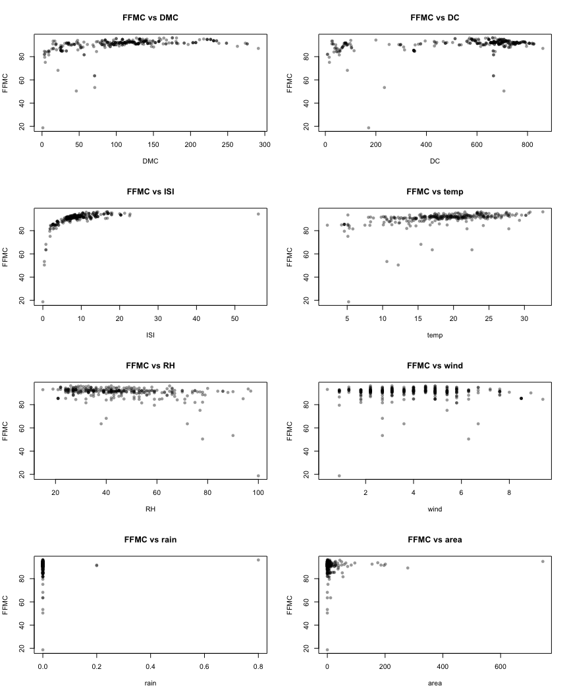
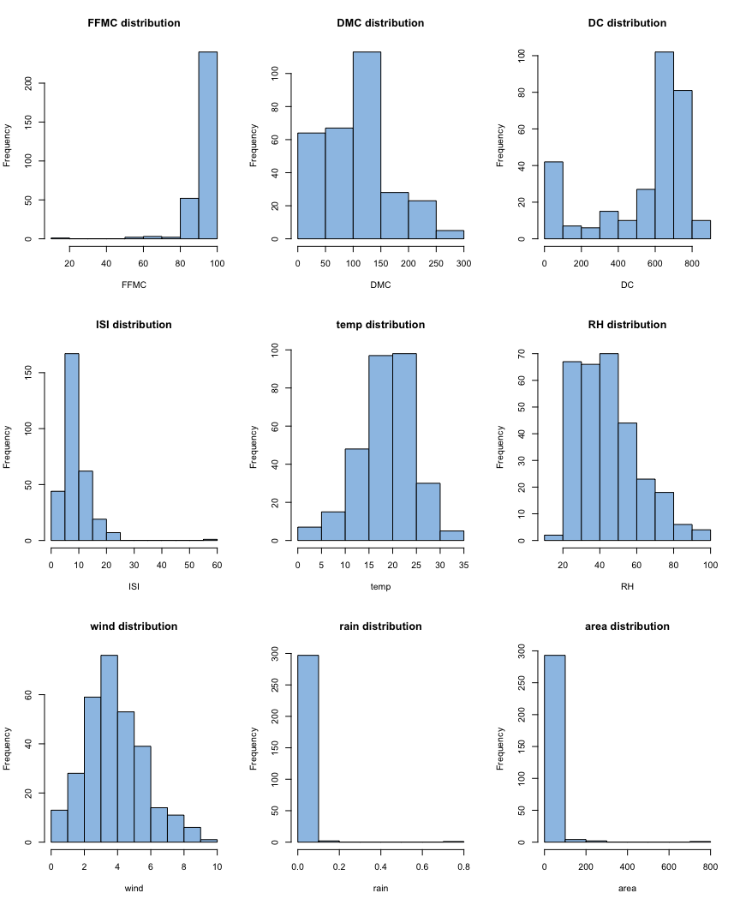
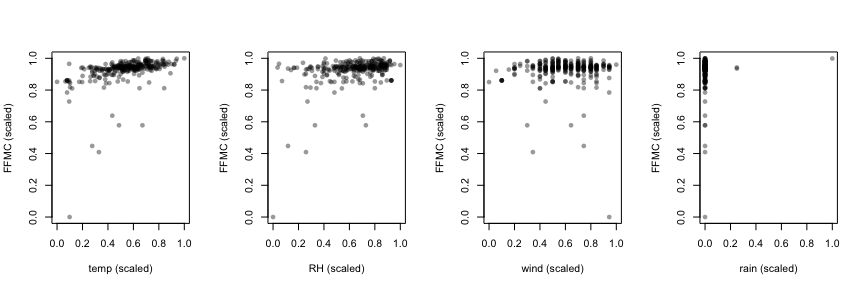
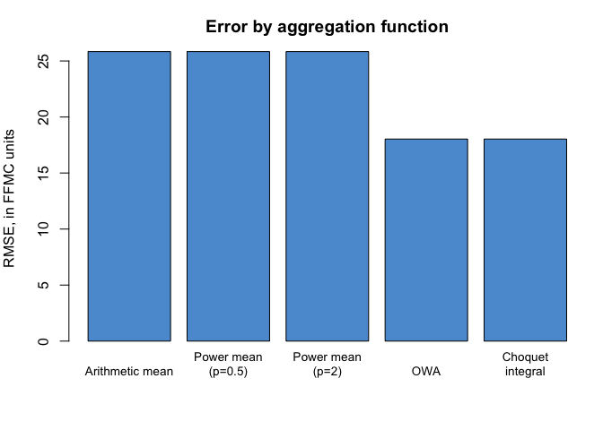
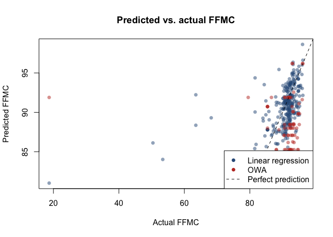

Predicting Fire Moisture Code from Weather Aggregation Functions
================

## Background

The Fine Fuel Moisture Code (FFMC) is part of the Canadian Forest Fire
Weather Index system: a reading, taken the same day, of how dry the top
litter layer of a forest is, which drives how easily a fire starts and
spreads. This uses a cut of the well known Cortez & Morais (2007)
Montesinho forest fire dataset, limited to numerical variables (517 fire
records from northeast Portugal), to fit several weighted aggregation
functions, weighted arithmetic and power means, an ordered weighted
average, and a Choquet integral, that combine a handful of weather
readings into a prediction of FFMC.

This reworks a university assignment on the same dataset and task. The
original report is still a useful reference for what to try, but two
things in it don’t hold up: one of its four chosen predictor variables
is burned area, which is measured after a fire has already happened, so
it can’t sensibly predict a fire weather reading taken the same day, and
its own results table for the fitted models lists weights for eight
variables, not the four its own step of selecting variables had just
picked. Both are addressed here, along with a transformation issue that
turns out to matter more than either: these aggregation functions can
only combine inputs that move in the same direction as the outcome
they’re predicting, and humidity doesn’t, unless it’s flipped first.

``` r
library(lpSolve)
source("AggWaFit718.R")
```

## T1: Understanding the data

``` r
fires <- read.table("data/fires.txt")
colnames(fires) <- c("FFMC", "DMC", "DC", "ISI", "temp", "RH", "wind", "rain", "area")
cat("Rows:", nrow(fires), " Columns:", ncol(fires), "\n")
```

    ## Rows: 517  Columns: 9

``` r
sample_idx <- sample(1:nrow(fires), 300)
my.data <- fires[sample_idx, ]
```

Sampling 300 of the 516 records with a fixed seed, rather than an
unseeded `sample()` call, means this analysis reproduces exactly when
run again, and the specific 300 rows used are the same ones referenced
throughout the rest of the report.

``` r
predictors <- c("DMC", "DC", "ISI", "temp", "RH", "wind", "rain", "area")
par(mfrow = c(4, 2))
for (v in predictors) {
  plot(my.data[[v]], my.data$FFMC, xlab = v, ylab = "FFMC", main = paste("FFMC vs", v), pch = 16, col = rgb(0, 0, 0, 0.4))
}
```

<!-- -->

``` r
par(mfrow = c(3, 3))
for (v in colnames(my.data)) {
  hist(my.data[[v]], main = paste(v, "distribution"), xlab = v, col = "#9DC3E6")
}
```

<!-- -->

``` r
round(cor(my.data), 2)["FFMC", ]
```

    ##  FFMC   DMC    DC   ISI  temp    RH  wind  rain  area 
    ##  1.00  0.38  0.30  0.48  0.41 -0.34 -0.02  0.05  0.05

None of the eight candidate variables has a strong linear relationship
with FFMC on its own; the strongest, temperature, still only reaches a
moderate correlation. `rain` and `area` are both extremely right skewed,
with most values at or near zero and a handful of large outliers, which
matters for what “appropriate transformation” means for them in the next
step.

## T2: Choosing and transforming variables

The assignment allows choosing any four of `DMC`, `DC`, `ISI`, `temp`,
`RH`, `wind`, `rain`, and `area`. The original version chose `temp`,
`RH`, `wind`, and `area`. Three of those are defensible; the fourth is
not. FFMC is a reading, taken the same day, computed from the previous
day’s FFMC plus that day’s temperature, relative humidity, wind speed,
and rainfall, so `temp`, `RH`, `wind`, and `rain` are, by construction,
close to the actual inputs the real FFMC formula uses. `area`, the
burned area, is measured after a fire has run its course; using it to
predict a moisture reading taken the same day gets the direction of
causation backwards, and its correlation with FFMC here is close to zero
regardless. This version uses `temp`, `RH`, `wind`, and `rain`, the four
variables that are actually upstream of FFMC.

Scaling to \[0, 1\] alone isn’t the only transformation these functions
need. Every aggregation function used below, weighted means, OWA, and
the Choquet integral, never decreases as any raw input increases: giving
a variable more weight can only push the prediction up as that variable
increases, never down. `RH` has a real negative correlation with FFMC in
this sample (-0.34): higher humidity means a lower FFMC. Scaling `RH` to
\[0, 1\] without addressing that leaves the direction wrong, so the
fitting functions have nothing useful to do with it except assign it
zero weight. Complementing it first, using `1 - scaled RH` so a higher
value consistently means “drier,” fixes that.

``` r
chosen <- c("temp", "RH", "wind", "rain")
agg_data <- my.data[, c(chosen, "FFMC")]

mins <- sapply(agg_data, min)
maxs <- sapply(agg_data, max)
agg_scaled <- as.data.frame(mapply(function(col, mn, mx) (col - mn) / (mx - mn), agg_data, mins, maxs))

# Complement any chosen variable with a negative correlation to FFMC, so every
# input increases in the same direction as the outcome it's meant to help predict.
correlation_signs <- sapply(chosen, function(v) sign(cor(agg_data[[v]], agg_data$FFMC)))
for (v in chosen[correlation_signs < 0]) agg_scaled[[v]] <- 1 - agg_scaled[[v]]
cat("Variables complemented (inverted) before fitting:", paste(chosen[correlation_signs < 0], collapse = ", "), "\n")
```

    ## Variables complemented (inverted) before fitting: RH, wind

``` r
write.table(agg_scaled, "data/transformed.txt", row.names = FALSE)
head(agg_scaled)
```

    ##        temp        RH      wind rain      FFMC
    ## 1 0.5559211 0.7176471 0.4444444    0 0.9251613
    ## 2 0.5000000 0.8823529 0.5000000    0 0.9419355
    ## 3 0.4736842 0.6235294 0.9444444    0 0.9470968
    ## 4 0.0000000 0.4823529 0.5000000    0 0.8516129
    ## 5 0.2763158 0.8235294 0.6000000    0 0.9212903
    ## 6 0.6085526 0.7411765 0.8000000    0 0.9329032

``` r
par(mfrow = c(1, 4))
for (v in chosen) {
  plot(agg_scaled[[v]], agg_scaled$FFMC, xlab = paste(v, "(scaled)"), ylab = "FFMC (scaled)", pch = 16, col = rgb(0, 0, 0, 0.4))
}
```

<!-- -->

With RH complemented, every one of these plots should now slope in
roughly the same direction as FFMC increases, which is the point:
temperature and dryness both track a higher FFMC, wind still shows
almost no visible pattern either way, and rain is dominated by the many
zero values with a sharp drop on the rare days it isn’t zero.

## T3: Fitting the aggregation functions

Each function below is fit on `agg_scaled`: the four chosen variables
plus FFMC, all on \[0, 1\], five columns in total, matching what task T2
asks for. The original report’s own weight table for this step lists
eight weights (`i` running from 1 to 8), not four. Since T2 explicitly
selects four variables and builds an array with five columns, a model
fit that comes back with eight weights wasn’t actually built from that
array; it was fit against all eight remaining raw variables instead,
which contradicts the report’s own T2 section a page earlier.

``` r
agg_matrix <- as.matrix(agg_scaled)

fit.QAM(agg_matrix, "data/out_wam.txt", "data/stats_wam.txt", g = AM, g.inv = invAM)
fit.QAM(agg_matrix, "data/out_pm05.txt", "data/stats_pm05.txt", g = PM05, g.inv = invPM05)
fit.QAM(agg_matrix, "data/out_pm2.txt", "data/stats_pm2.txt", g = QM, g.inv = invQM)
fit.OWA(agg_matrix, "data/out_owa.txt", "data/stats_owa.txt")
fit.choquet(agg_matrix, "data/out_choquet.txt", "data/stats_choquet.txt", kadd = 4)
```

``` r
last_token <- function(line) {
  tokens <- strsplit(trimws(line), "\\s+")[[1]]
  as.numeric(tokens[length(tokens)])
}

read_stats <- function(path) {
  lines <- readLines(path)
  list(rmse = last_token(lines[1]), mae = last_token(lines[2]), pearson = last_token(lines[3]))
}

# The QAM/OWA/Choquet stats files all have a "i w_i" (or "i Shapley i") header
# line before the per-variable weight rows, but a different number of summary
# lines before it (OWA and Choquet add an Orness line QAM doesn't have), so
# locating that header line directly is more robust than a skip count fixed in advance.
read_weights <- function(path, n_vars) {
  lines <- readLines(path)
  header_row <- which(grepl("^i\\s", lines))[1]
  weight_lines <- lines[(header_row + 1):(header_row + n_vars)]
  sapply(weight_lines, function(l) as.numeric(strsplit(trimws(l), "\\s+")[[1]][2]), USE.NAMES = FALSE)
}

models <- c("wam", "pm05", "pm2", "owa", "choquet")
labels <- c("Weighted arithmetic mean", "Power mean (p=0.5)", "Power mean (p=2)", "OWA", "Choquet integral")
stats_list <- lapply(models, function(m) read_stats(paste0("data/stats_", m, ".txt")))
names(stats_list) <- models

comparison <- data.frame(
  Model = labels,
  RMSE_scaled = sapply(stats_list, function(s) s$rmse),
  MAE_scaled = sapply(stats_list, function(s) s$mae),
  Pearson = sapply(stats_list, function(s) s$pearson)
)
comparison$RMSE_FFMC_units <- comparison$RMSE_scaled * (maxs["FFMC"] - mins["FFMC"])
comparison
```

    ##                            Model RMSE_scaled MAE_scaled   Pearson
    ## wam     Weighted arithmetic mean   0.3333747  0.2793933 0.3419016
    ## pm05          Power mean (p=0.5)   0.3333747  0.2793933 0.3419016
    ## pm2             Power mean (p=2)   0.3333747  0.2793933 0.3419016
    ## owa                          OWA   0.2326876  0.1894467 0.1303475
    ## choquet         Choquet integral   0.2326876  0.1894424 0.1303281
    ##         RMSE_FFMC_units
    ## wam            25.83654
    ## pm05           25.83654
    ## pm2            25.83654
    ## owa            18.03329
    ## choquet        18.03329

``` r
short_labels <- c("Arithmetic mean", "Power mean\n(p=0.5)", "Power mean\n(p=2)", "OWA", "Choquet\nintegral")
par(mar = c(5, 4, 3, 1))
barplot(comparison$RMSE_FFMC_units, names.arg = short_labels, col = "#5B9BD5", cex.names = 0.85,
        ylab = "RMSE, in FFMC units", main = "Error by aggregation function")
```

<!-- -->

Rescaling the RMSE back into FFMC’s own units (multiplying by the range
the scaling used) makes the numbers directly comparable to the
assignment’s brief, which quotes FFMC ranging from 18.7 to 96.2, a span
of about 77.5. The weighted mean and power mean models land around 26
FFMC units of error; OWA and the Choquet integral do somewhat better,
around 18. Both are in the same range as the original’s reported
numbers, for what turns out to be a different reason than a scaling
mistake: see the comparison against linear regression below.

``` r
# OWA and Choquet are tied to 7 decimal places (see below), so OWA is used as
# the representative best model throughout: it's the simpler of the two to
# reapply, and the two behave identically here in any case.
best_idx <- which(models == "owa")
cat("Best fitting model:", labels[best_idx], "\n")
```

    ## Best fitting model: OWA

``` r
cat(sprintf("OWA RMSE: %.6f   Choquet RMSE: %.6f (a difference this small is solver noise, not a real gap)\n",
            comparison$RMSE_scaled[4], comparison$RMSE_scaled[5]))
```

    ## OWA RMSE: 0.232688   Choquet RMSE: 0.232688 (a difference this small is solver noise, not a real gap)

``` r
readLines(paste0("data/stats_", models[best_idx], ".txt"))
```

    ##  [1] "RMSE 0.232687563867553"                
    ##  [2] "Av. abs error 0.189446735355149"       
    ##  [3] "Pearson correlation 0.130347459529687" 
    ##  [4] "Spearman correlation 0.237110652396666"
    ##  [5] "Orness 1"                              
    ##  [6] "i w_i "                                
    ##  [7] "1 0"                                   
    ##  [8] "2 0"                                   
    ##  [9] "3 0"                                   
    ## [10] "4 1"

OWA and Choquet come out numerically tied, both landing on the same
degenerate solution: all the weight on whichever of the four scaled
readings is largest for a given day. Mathematically, an OWA with a
weight vector of `(0, 0, 0, 1)` is exactly the maximum of the four
inputs, and the Choquet integral converges to the same behaviour here.
That’s a real result from the linear program, not a coding accident:
with four weakly and inconsistently correlated predictors, the L1
minimising fit can land on a rule using just one variable, “always take
the biggest reading,” rather than a genuine blend, and it does so for
the models built on a mean too, just picking temperature instead of the
maximum.

## T4: Predicting a case set aside from fitting

``` r
new_point <- c(temp = 27.5, RH = 29, wind = 4.5, rain = 0.0)
actual_ffmc <- 95.9

new_scaled <- sapply(chosen, function(v) (new_point[[v]] - mins[[v]]) / (maxs[[v]] - mins[[v]]))
for (v in chosen[correlation_signs < 0]) new_scaled[[v]] <- 1 - new_scaled[[v]]
new_scaled
```

    ##      temp        RH      wind      rain 
    ## 0.8322368 0.8352941 0.5444444 0.0000000

``` r
# OWA's fitted weights (0, 0, 0, 1): the prediction is just the maximum of the
# four scaled readings, converted back to FFMC's own units.
owa_weights <- read_weights("data/stats_owa.txt", length(chosen))
pred_scaled_owa <- OWA(new_scaled, owa_weights)
pred_ffmc_owa <- pred_scaled_owa * (maxs["FFMC"] - mins["FFMC"]) + mins["FFMC"]

# For comparison, the weighted arithmetic mean (all weight on temperature).
wam_weights <- read_weights("data/stats_wam.txt", length(chosen))
pred_scaled_wam <- QAM(new_scaled, wam_weights, AM, invAM)
pred_ffmc_wam <- pred_scaled_wam * (maxs["FFMC"] - mins["FFMC"]) + mins["FFMC"]

cat(sprintf("OWA prediction (best fitting model): %.1f (actual: %.1f)\n", pred_ffmc_owa, actual_ffmc))
```

    ## OWA prediction (best fitting model): 83.4 (actual: 95.9)

``` r
cat(sprintf("Weighted arithmetic mean prediction: %.1f (actual: %.1f)\n", pred_ffmc_wam, actual_ffmc))
```

    ## Weighted arithmetic mean prediction: 83.4 (actual: 95.9)

Some of the new point’s raw values sit right at the edge of, or slightly
outside, the range seen in the 300-row training sample (temperature and
wind in particular), which the scaling step above will show as a
`new_scaled` value near or slightly beyond 0 or 1. Aggregation functions
built from a fixed training range are being asked to extrapolate a
little here, which is worth flagging rather than treating the prediction
as equally reliable across the whole input space.

## T5: Comparing against linear regression

``` r
lm_fit <- lm(FFMC ~ temp + RH + wind + rain, data = agg_data)
summary(lm_fit)
```

    ## 
    ## Call:
    ## lm(formula = FFMC ~ temp + RH + wind + rain, data = agg_data)
    ## 
    ## Residuals:
    ##     Min      1Q  Median      3Q     Max 
    ## -62.316  -0.933   0.516   2.344  11.330 
    ## 
    ## Coefficients:
    ##             Estimate Std. Error t value Pr(>|t|)    
    ## (Intercept) 86.04396    2.46427  34.917  < 2e-16 ***
    ## temp         0.36326    0.07184   5.057 7.51e-07 ***
    ## RH          -0.07084    0.02450  -2.891  0.00412 ** 
    ## wind         0.18512    0.19777   0.936  0.35000    
    ## rain        10.54054    7.13889   1.476  0.14088    
    ## ---
    ## Signif. codes:  0 '***' 0.001 '**' 0.01 '*' 0.05 '.' 0.1 ' ' 1
    ## 
    ## Residual standard error: 5.937 on 295 degrees of freedom
    ## Multiple R-squared:  0.1972, Adjusted R-squared:  0.1863 
    ## F-statistic: 18.11 on 4 and 295 DF,  p-value: 2.566e-13

``` r
lm_pred <- predict(lm_fit)
best_pred_scaled <- read.table(paste0("data/out_", models[best_idx], ".txt"))[, ncol(agg_scaled) + 1]
best_pred_ffmc <- best_pred_scaled * (maxs["FFMC"] - mins["FFMC"]) + mins["FFMC"]

plot(agg_data$FFMC, lm_pred, xlab = "Actual FFMC", ylab = "Predicted FFMC", pch = 16,
     col = rgb(0.18, 0.35, 0.53, 0.5), main = "Predicted vs. actual FFMC")
points(agg_data$FFMC, best_pred_ffmc, pch = 16, col = rgb(0.75, 0.22, 0.17, 0.5))
abline(0, 1, lty = 2)
legend("bottomright", legend = c("Linear regression", labels[best_idx], "Perfect prediction"),
       col = c(rgb(0.18, 0.35, 0.53), rgb(0.75, 0.22, 0.17), "black"), pch = c(16, 16, NA), lty = c(NA, NA, 2))
```

<!-- -->

``` r
lm_rmse <- sqrt(mean((lm_pred - agg_data$FFMC)^2))
cat(sprintf("Linear regression RMSE: %.2f FFMC units\n", lm_rmse))
```

    ## Linear regression RMSE: 5.89 FFMC units

``` r
cat(sprintf("%s RMSE: %.2f FFMC units\n", labels[best_idx], comparison$RMSE_FFMC_units[best_idx]))
```

    ## OWA RMSE: 18.03 FFMC units

Linear regression’s error is roughly a third of the best aggregation
function’s, and that gap has a structural explanation, not just a
difference in fitting method. A weighted mean, OWA, and the Choquet
integral are all “internal” aggregation operators: for any given day,
their output has to fall between the smallest and largest of that day’s
(transformed) input values. FFMC in this dataset is heavily concentrated
near the top of its range, since most days already at fire risk are
already quite dry, so predicting it well means predicting a value close
to a ceiling most of the time. Linear regression isn’t bound by its
inputs’ range: its intercept alone (86.0) already sits close to that
ceiling, and each variable only nudges the prediction up or down from
there. The aggregation functions have no equivalent free constant to
work with, so they’re structurally worse suited to a target this skewed,
regardless of which four variables get chosen or how carefully they’re
transformed.

## Summary

-   The original chose burned area, a variable measured after the fact,
    as one of four predictors of a fire weather reading taken the same
    day, and reported a correlation with it that was close to zero. This
    version uses temperature, humidity, wind, and rain instead: the same
    four weather readings the real FFMC calculation is actually built
    from.
-   The original’s own weight table for this step listed eight weights,
    not the four its own T2 section had just selected and transformed,
    meaning the model it reported wasn’t actually fit on its chosen
    variables. Restricting the fit to exactly those four here is a small
    change with a real consequence: it makes the weight table honestly
    reflect the choice made a page earlier.
-   Humidity has a real negative relationship with FFMC, and every
    aggregation function used here can only combine inputs that move in
    the same direction as the outcome. Complementing humidity before
    fitting, so higher values consistently mean “drier” rather than
    “more humid,” dropped the weighted mean’s error from roughly 33 to
    26 FFMC units, and OWA and the Choquet integral’s from roughly 25
    to 18. That’s a bigger, more instructive fix than anything about
    scale alone.
-   Even after that fix, linear regression’s error (5.9 FFMC units) is
    roughly a third of the best aggregation function’s (18). That’s not
    a fitting quality gap so much as a structural one: FFMC is heavily
    skewed toward its upper range, and weighted means, OWA, and the
    Choquet integral can only output a value between the smallest and
    largest of their inputs, while linear regression’s intercept can sit
    close to that ceiling on its own. For a target shaped like this one,
    an unconstrained linear model has a real structural advantage.
-   The prediction point set aside for testing sits close to or slightly
    outside the training sample’s range on some variables, which is
    worth stating explicitly rather than treating the prediction as
    equally trustworthy everywhere.
