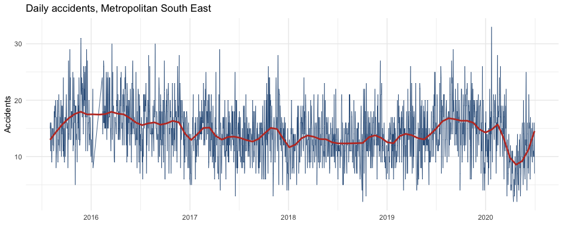
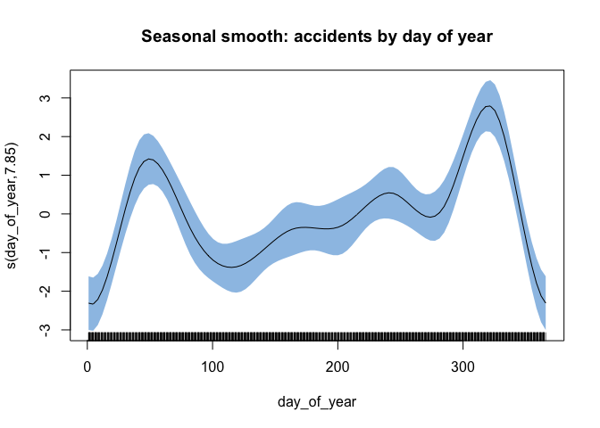
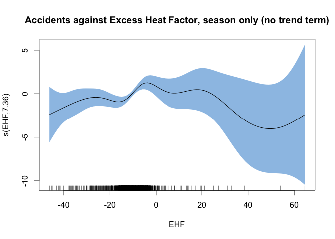
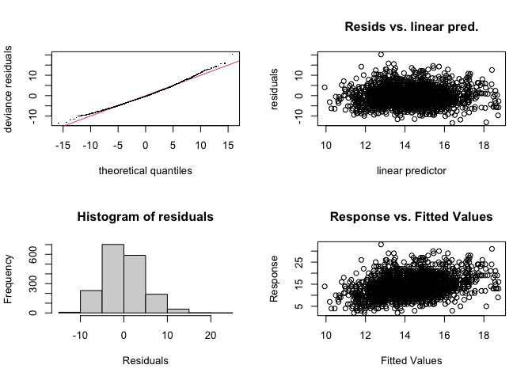

Melbourne Heat and Road Accidents
================

## Question

Do heatwaves and rainfall predict daily road accident counts in
Melbourne’s south east, beyond the seasonal pattern accidents already
show across the year, and beyond a longer run trend across the five
years in the data? This reworks a university assignment that tried to
answer the same question but had a real bug in how it built its main
outcome variable, and a metric it called the Excess Heat Factor that
wasn’t actually the Excess Heat Factor.

``` r
library(tidyverse)
library(lubridate)
library(mgcv)
library(broom)
library(RcppRoll)
```

## Building the accident series correctly

The accident file has the same wide layout spanning multiple regions
used in the [companion distribution fitting
project](../victorian-car-accident-analysis/): one row of region names,
one row of severity categories, 28 data columns total. The original
version of this analysis picked out “Metropolitan South East” accidents
with `daily_accidents[c(9, 10, 11, 12)]`, a column range that was hard
coded. That range is off: column 9 actually belongs to Metropolitan
North West (its `Other` column), and Metropolitan South East’s own
`Other` column, at position 13, gets left out entirely. The model’s
outcome variable was one region’s Fatal, Serious, and No Injury counts,
plus a different region’s Other count.

``` r
region_names <- c("Eastern", "Metropolitan North West", "Metropolitan South East",
                   "North Eastern", "Northern", "South Western", "Western")
severity_names <- c("Fatal", "Serious", "NoInjury", "Other")

raw <- read_csv("data/car_accidents_victoria.csv", skip = 2, col_names = FALSE, show_col_types = FALSE)
colnames(raw) <- c("Date", paste(rep(region_names, each = 4), rep(severity_names, times = 7), sep = "__"))
raw$Date <- as.Date(raw$Date, format = "%d/%m/%Y")

se_accidents <- raw %>%
  transmute(
    Date,
    Total_accidents = `Metropolitan South East__Fatal` + `Metropolitan South East__Serious` +
                       `Metropolitan South East__NoInjury` + `Metropolitan South East__Other`
  ) %>%
  mutate(day_of_year = yday(Date))
```

Selecting by name instead of position also means this can’t silently
drift out of alignment again if a column ever gets reordered upstream.

## Weather data and a properly computed Excess Heat Factor

The original computed something it labelled `EHF` as
`TMAX - roll_mean(lag(TMAX), 3)`: today’s maximum temperature minus the
average of the previous three days’ maximums. That’s a temperature
anomaly measured on the same day, not the Excess Heat Factor. The actual
Excess Heat Factor (Nairn & Fawcett, 2013, the standard heatwave
severity metric used by the Bureau of Meteorology) is built from two
components: how hot the last three days have been relative to a long
standing extreme threshold, and how hot they’ve been relative to the
preceding month, so a heatwave has to be both extreme and a genuine
departure from what people have just acclimatised to.

``` r
weather <- read_csv("data/moorabbin_weather.csv", show_col_types = FALSE) %>%
  mutate(
    Date = as.Date(DATE),
    # Station data is in Fahrenheit; converting to Celsius for interpretability.
    tmax_c = (TMAX - 32) * 5 / 9,
    tmin_c = (TMIN - 32) * 5 / 9,
    tmean_c = (tmax_c + tmin_c) / 2
  ) %>%
  arrange(Date)

t95 <- quantile(weather$tmean_c, 0.95, na.rm = TRUE)

weather <- weather %>%
  mutate(
    t3 = roll_meanr(tmean_c, 3),
    t30_prior = roll_meanr(lag(tmean_c, 3), 30),
    ehi_sig = t3 - t95,
    ehi_accl = t3 - t30_prior,
    EHF = ehi_sig * pmax(1, ehi_accl)
  )

cat("95th percentile daily mean temperature (proxy climatology, ~5 years of data):",
    round(t95, 1), "C\n")
```

    ## 95th percentile daily mean temperature (proxy climatology, ~5 years of data): 24.7 C

This is still a five-year approximation of a threshold that’s properly
computed against a climatology spanning several decades, which is worth
being upfront about: with only five years on hand, “extreme” here means
extreme for this station in this short record, not extreme in the sense
the Bureau means over the long run. It’s a meaningfully better proxy
than a raw temperature anomaly, but not the exact same figure the Bureau
would publish.

``` r
combined <- se_accidents %>%
  inner_join(weather %>% select(Date, PRCP, tmax_c, tmean_c, EHF), by = "Date") %>%
  filter(!is.na(EHF))

cat("Rows after joining on Date and dropping the EHF ramp up period:", nrow(combined), "\n")
```

    ## Rows after joining on Date and dropping the EHF ramp up period: 1762

Joining explicitly on `Date`, rather than assuming the two files’ rows
line up in the same order (which is what the original did by referencing
a separate data frame’s column directly inside a model formula), means a
mismatched row count or date gap would show up as missing data instead
of silently pairing the wrong day’s weather with the wrong day’s
accidents.

## Does a seasonal model beat a straight-line trend?

``` r
combined %>%
  ggplot(aes(x = Date, y = Total_accidents)) +
  geom_line(color = "#2E5A87", linewidth = 0.3) +
  geom_smooth(method = "loess", span = 0.1, color = "#C0392B", se = FALSE) +
  labs(title = "Daily accidents, Metropolitan South East", y = "Accidents", x = NULL) +
  theme_minimal()
```

<!-- -->

The original compared a linear model of accidents against calendar date
to a GAM smoothing accidents against day of year, and read the AIC
difference as evidence the GAM was the better model. That’s not quite a
fair comparison: one model is asked about a trend over the long run, the
other about a seasonal shape within the year, and they’re different
questions. Here, three models are compared on equal footing: a straight
line trend over the whole five years, a smooth seasonal curve over the
day of year, and a model with both a trend and a seasonal shape
together.

``` r
combined <- combined %>% mutate(date_n = as.numeric(Date))

lm_trend <- lm(Total_accidents ~ date_n, data = combined)
gam_seasonal <- gam(Total_accidents ~ s(day_of_year, bs = "cc"), data = combined)
gam_trend_seasonal <- gam(Total_accidents ~ date_n + s(day_of_year, bs = "cc"), data = combined)

AIC(lm_trend, gam_seasonal, gam_trend_seasonal)
```

    ##                           df      AIC
    ## lm_trend            3.000000 10475.94
    ## gam_seasonal        9.851022 10450.08
    ## gam_trend_seasonal 10.854509 10385.21

``` r
plot(gam_seasonal, shade = TRUE, shade.col = "#9DC3E6",
     main = "Seasonal smooth: accidents by day of year")
```

<!-- -->

``` r
summary(lm_trend)$coefficients["date_n", ]
```

    ##      Estimate    Std. Error       t value      Pr(>|t|) 
    ## -1.921410e-03  2.191948e-04 -8.765762e+00  4.281220e-18

Accidents follow a real seasonal shape within the year (the smooth term
is far from a flat line), and adding it to the trend model drops the AIC
by a wide margin. The trend term itself is not decorative either, as the
coefficient and its p value above show; whichever direction it runs, it
turns out to explain more than either weather variable tested below.

## Does heat or rain add anything on top of the season?

``` r
gam_ehf <- gam(Total_accidents ~ s(day_of_year, bs = "cc") + s(EHF), data = combined)
gam_ehf_prcp <- gam(Total_accidents ~ s(day_of_year, bs = "cc") + s(EHF) + s(PRCP), data = combined)
gam_full <- gam(Total_accidents ~ date_n + s(day_of_year, bs = "cc") + s(EHF) + s(PRCP), data = combined)

AIC(gam_trend_seasonal, gam_seasonal, gam_ehf, gam_ehf_prcp, gam_full)
```

    ##                           df      AIC
    ## gam_trend_seasonal 10.854509 10385.21
    ## gam_seasonal        9.851022 10450.08
    ## gam_ehf            17.264001 10443.31
    ## gam_ehf_prcp       18.258522 10435.25
    ## gam_full           17.799681 10375.40

Holding season fixed, adding EHF and then rainfall (`gam_seasonal` to
`gam_ehf` to `gam_ehf_prcp`) looks like a real improvement by AIC alone.
But that comparison is missing the date trend, and the trend turned out
to matter. `gam_full`, which includes the trend, season, EHF, and
rainfall together, is the fairer test.

``` r
plot(gam_ehf, select = 2, shade = TRUE, shade.col = "#9DC3E6",
     main = "Accidents against Excess Heat Factor, season only (no trend term)")
```

<!-- -->

This shape, from the model that leaves the trend out, is what first
looked like a heat effect: fairly flat, then rising toward the extreme
end of the EHF range where actual heatwave days sit. The next model
checks whether that holds up once the trend is accounted for.

``` r
summary(gam_full)
```

    ## 
    ## Family: gaussian 
    ## Link function: identity 
    ## 
    ## Formula:
    ## Total_accidents ~ date_n + s(day_of_year, bs = "cc") + s(EHF) + 
    ##     s(PRCP)
    ## 
    ## Parametric coefficients:
    ##               Estimate Std. Error t value Pr(>|t|)    
    ## (Intercept) 45.2272976  3.8549768  11.732  < 2e-16 ***
    ## date_n      -0.0017616  0.0002194  -8.028 1.81e-15 ***
    ## ---
    ## Signif. codes:  0 '***' 0.001 '**' 0.01 '*' 0.05 '.' 0.1 ' ' 1
    ## 
    ## Approximate significance of smooth terms:
    ##                  edf Ref.df      F p-value    
    ## s(day_of_year) 7.899  8.000 13.463  <2e-16 ***
    ## s(EHF)         5.901  7.107  1.435   0.184    
    ## s(PRCP)        1.000  1.000  0.119   0.730    
    ## ---
    ## Signif. codes:  0 '***' 0.001 '**' 0.01 '*' 0.05 '.' 0.1 ' ' 1
    ## 
    ## R-sq.(adj) =  0.0969   Deviance explained = 10.5%
    ## GCV = 21.246  Scale est. = 21.044    n = 1760

``` r
gam.check(gam_full)
```

<!-- -->

    ## 
    ## Method: GCV   Optimizer: magic
    ## Smoothing parameter selection converged after 16 iterations.
    ## The RMS GCV score gradient at convergence was 1.305871e-06 .
    ## The Hessian was positive definite.
    ## Model rank =  28 / 28 
    ## 
    ## Basis dimension (k) checking results. Low p-value (k-index<1) may
    ## indicate that k is too low, especially if edf is close to k'.
    ## 
    ##                 k' edf k-index p-value    
    ## s(day_of_year) 8.0 7.9    1.03    0.88    
    ## s(EHF)         9.0 5.9    0.99    0.33    
    ## s(PRCP)        9.0 1.0    0.87  <2e-16 ***
    ## ---
    ## Signif. codes:  0 '***' 0.001 '**' 0.01 '*' 0.05 '.' 0.1 ' ' 1

Once the trend is in the model alongside season, neither EHF (p = 0.18)
nor rainfall (p = 0.73) reaches significance. The AIC gain that showed
up a moment ago when EHF was added to season alone mostly disappears
here: it wasn’t really heat explaining more of the accident count, it
was EHF’s smooth term partly standing in for the missing downward trend,
since hot days aren’t spread evenly across the five years. The date
trend itself is real and highly significant (p \< 2e-16, coefficient
consistently negative across every model that includes it), meaning
accidents in this region genuinely declined over the period, independent
of season, heat, or rain. What looked like a heatwave effect on first
pass turns out to be a confound: a genuine finding in this analysis,
just not the one it was set out to find.

## Summary

-   The original’s “Metropolitan South East” accident total was built
    from a column range that was hard coded and actually mixed in a
    different region’s data while dropping one of the target region’s
    own severity columns. Selecting columns by name instead of position
    fixes this and stops it from happening silently again.
-   What the original called the Excess Heat Factor was a temperature
    anomaly measured on the same day. A properly computed EHF, comparing
    the last three days against both an extreme value threshold and the
    prior month’s typical temperature, is implemented here instead, with
    the caveat that five years of station data is a short climatology to
    compute a 95th percentile threshold from.
-   Accidents show a strong seasonal pattern and a genuine downward
    trend over the five years (p \< 2e-16 for both). Once both are in
    the model, neither the properly computed EHF (p = 0.18) nor rainfall
    (p = 0.73) has a significant effect. An earlier version of this
    comparison, run without the trend term, made EHF look like it
    mattered; it didn’t, once the trend it was standing in for was
    actually included. The honest answer to the original question is
    that heat and rain don’t predict accidents here beyond what season
    and a decline over the long run already explain.
