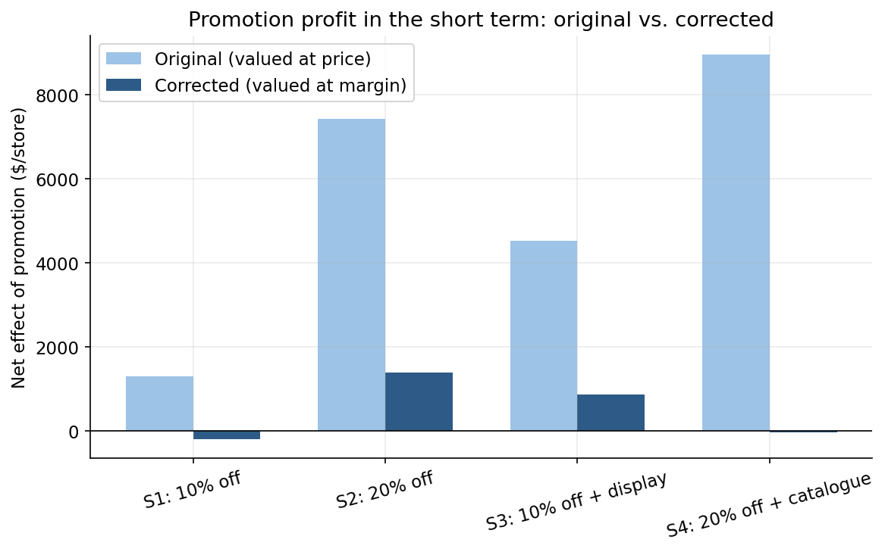
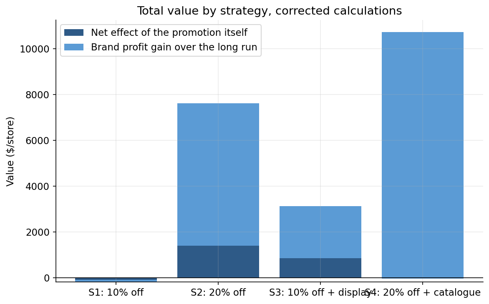
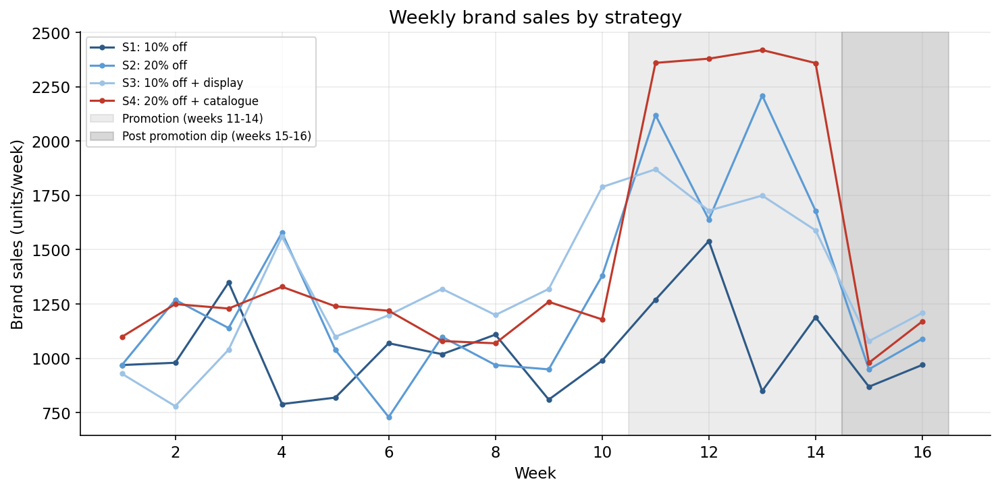

# Promotion Strategy Evaluation

A price promotion case study: a cereal bar brand with about 20% category share trials four different promotion strategies in four comparable stores over 26 weeks, and needs a recommendation on which one, if any, to roll out everywhere.

This started as a university marketing analytics assignment. The original spreadsheet's formulas contain a real, quantifiable error that inflates every strategy's apparent profit in the short term, and a mislabeled metric that reports one number under another number's name. Both are fixed here, and the fix changes the story in a genuinely interesting way, without changing the final recommendation.

The full analysis is in [`analysis.py`](analysis.py), which reads the weekly experiment data and reproduces every calculation from scratch.

## The case

Four stores each ran one of four pricing strategies for four weeks (a 10% or 20% price cut, with or without extra advertising spend), with ten weeks of baseline sales observed before the promotion and two weeks of post promotion dip observed after. A separately measured average taken over a longer run is also given for each store's sales once the dip period has passed. The regular price is $5 with a $3 margin; every promotional price implies a lower margin, since the $2 unit cost behind that margin doesn't go away just because the price is cut.

## What was wrong with the original

- **Incremental sales and the post promotion dip were valued at price, not margin.** The original's spreadsheet computed "incremental gain" as extra units sold during the promotion multiplied by the *promotional price* ($4.50 or $4), and "post promotion loss" as the sales dip multiplied by the *regular price* ($5). Both of those already have a $2 per unit cost baked in; multiplying by price rather than margin credits the promotion with revenue it never actually kept as profit. Tellingly, a different row further down the same spreadsheet (the profit calculation further down that covers the long run) gets this right, multiplying by margin, so the fix isn't a new idea, it's applying what the sheet already does correctly elsewhere.
- **A market share metric was labeled as a sales metric.** A row titled "% Gain in category sales" actually computes (brand sales over the long run ÷ category sales over the long run) − (baseline brand sales ÷ baseline category sales), which is the change in the brand's *share* of the category, not category sales growth. The two are easy to conflate but say different things: category sales can shrink while a brand's share of it grows, which is exactly what happens for Strategy 1 below.

## Findings

**Once incremental sales are valued at margin instead of price, two of the four strategies aren't actually profitable in the short term.** Strategy 1 (10% off, no extra spend) comes out at a small net loss (-$190) rather than the original's reported $1,300 gain, and Strategy 4 (20% off plus a catalogue feature) is roughly at break even (-$34) rather than the original's headline $8,956.



**Strategy 4 is still the best choice overall, but not for the reason the original numbers suggested.** Combining the corrected result for the promotion itself with each strategy's separately measured gain in brand profit over the long run, Strategy 4 comes out on top at roughly $10,725 in total value, ahead of Strategy 2 ($7,627), Strategy 3 ($3,132), and Strategy 1 (a small loss). But almost all of Strategy 4's value comes from its effect over the long run (about $10,759), not from the promotion event itself, which is close to break even on its own.



**That distinction matters for how confident the recommendation should be.** The figures for the long run are given as a single average over ten weeks following the dip, with no way to check how stable that average is. Strategy 2 (a plain 20% price cut, no extra advertising spend) is the only strategy that's solidly profitable on the promotion itself ($1,394) *and* shows a strong, believable gain over the long run ($6,233), with zero added retailer cost. If there's any doubt about how durable Strategy 4's uplift over the long run really is, Strategy 2 is the safer recommendation; if that figure for the long run holds up, Strategy 4 is worth the much larger catalogue spend.

**Strategy 1's "category sales" claim was a market share claim in disguise.** The original reported "0.23% gain in category sales" for Strategy 1. Recomputed correctly, category sales for that store actually *fell* by about 1.9% over the long run, while Carman's share of that shrinking category rose by about 0.23 percentage points, a real result, just not the one the label described.



## Repo structure

```
promotion-strategy-evaluation/
├── analysis.py       # end to end analysis, produces figures/ and results.json
├── data/weekly_data.csv
├── figures/           # generated charts
└── results.json       # every number behind the findings above, both original and corrected
```

## Running it

```bash
python3 -m venv .venv
source .venv/bin/activate
pip install pandas numpy matplotlib
python analysis.py
```

## Limitations

The averages for the long run are given directly in the case data rather than derived from an underlying weekly series, so there's no way to check their variability or test whether the difference between strategies is statistically meaningful rather than noise from running the trial in only one store per strategy.
