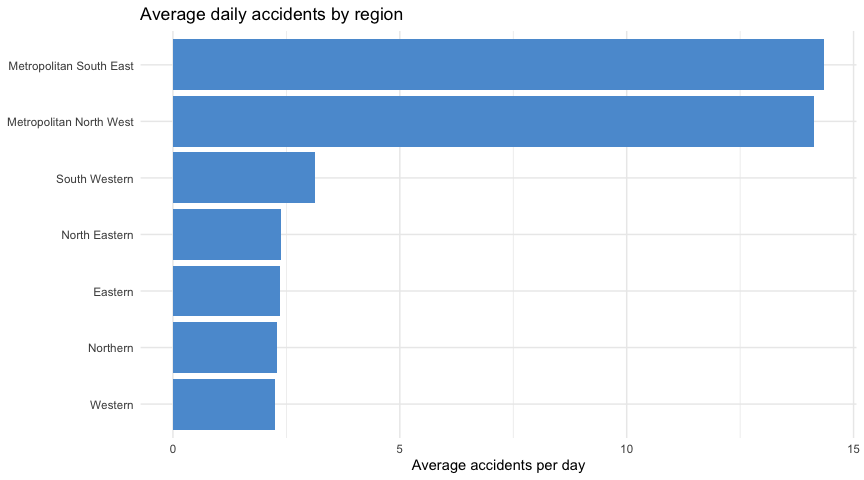
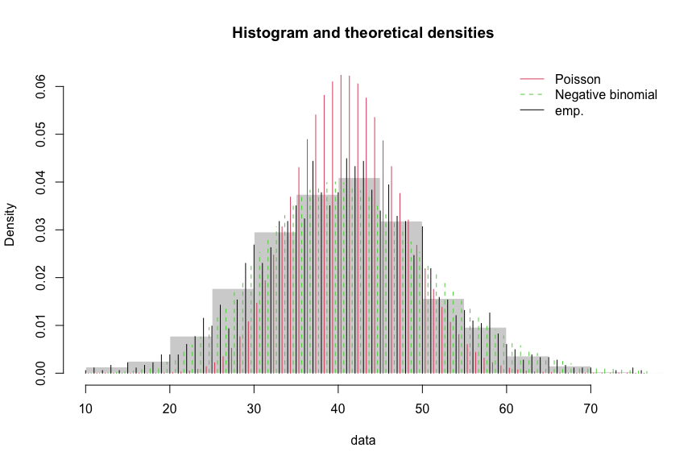

# Victorian Car Accident Severity Analysis

A statistical look at five years of daily road accident counts across Victoria's seven road safety regions: how accidents are distributed statistically, and whether the day of the week actually matters once regional traffic differences are accounted for.

This started as a university statistics assignment and has been reworked here: a data tidying step that quietly relied on a lucky coincidence in R's recycling rules has been replaced with a direct, correct approach, a distribution fitting comparison that had drifted onto the wrong variable has been redone on the right one, and a regression model extends the analysis past where the original left off.

## Dataset

1,827 days (1 July 2015 to 30 June 2020) of accident counts for each of Victoria's seven road safety regions, broken down by severity: Fatal, Serious, No Injury, and Other. The full analysis is in [`analysis.md`](analysis.md) (also viewable as a knitted [`analysis.html`](analysis.html)), generated from the R Markdown source in [`analysis.Rmd`](analysis.Rmd).

## What changed from the original coursework version

- **Tidying.** The original built each region's data frame by hand: seven almost identical blocks of `cbind` calls inside a loop that assigned most region labels as a single repeated string rather than a proper vector. It happened to still produce the right result, purely because R recycles a vector of length one to fill a longer column, not because the code was actually doing what it looked like it was doing. A single `pivot_longer` call replaces roughly 80 lines of that with four.
- **Missing values.** The original replaced the literal string `"N/A"` with `NA` before imputing two of the seven regions. That string doesn't appear anywhere in the file — the real gaps are 5 blank cells out of 51,156, spread across three regions the original never checked. All five are now identified directly and imputed consistently.
- **Distribution fitting.** The original fit a Poisson and a negative binomial to the right variable (`Total_accidents`, from one region's 200-row sample), correctly noted that count data needs a count distribution, and then switched to fitting Weibull, gamma, and exponential distributions, all built for continuous data, to an unrelated column (`Other / 10`) without explanation. This version keeps the comparison on `Total_accidents`, statewide, using all five years of data.

## Method

1. Reshape the wide CSV, which spans all seven regions, into a tidy long format.
2. Check for and impute missing values consistently across all seven regions.
3. Explore accident trends over time, by region, and by weekday.
4. Compare a Poisson and a negative binomial fit for daily statewide accident counts, using AIC and a check of how the variance compares to the mean to decide between them.
5. Extend into a negative binomial regression to test whether weekday and region actually predict accident counts, rather than stopping at "the plot looks like it varies."

## Findings

**Two regions account for most of the state's accidents.** Metropolitan South East and Metropolitan North West each average around 14 accidents a day, roughly five times the other five regions, which is a population and traffic volume story more than anything specific to those roads.



**Daily accident counts are overdispersed, so the negative binomial is the better fit.** The variance in the statewide daily total (99) is roughly 2.4 times the mean (40.9). A Poisson distribution forces variance to equal the mean, so it understates how spread out the real counts are; the negative binomial's AIC comes in about 1,000 points lower (13,616 versus 14,622), and its extra tail flexibility is visible directly against the histogram.



**Friday is genuinely the worst day, not just visually.** Controlling for region, a negative binomial regression puts Friday's accident rate about 16% above Monday's, the largest gap of the week. Sunday is the only day at or below Monday's rate, and even that difference isn't statistically significant. Tuesday through Saturday are all significantly higher than Monday.

## Repo structure

```
victorian-car-accident-analysis/
├── analysis.Rmd     # R Markdown source, runs the full analysis
├── analysis.md       # knitted output with all figures inline
├── analysis.html     # same, as a standalone HTML file
├── data/car_accidents_victoria.csv
└── figures/          # individual chart PNGs
```

## Running it

Requires R with the `tidyverse`, `fitdistrplus`, and `MASS` packages installed.

```r
rmarkdown::render("analysis.Rmd")
```

## Limitations

This dataset ends in the middle of 2020, so it doesn't capture any accident pattern shift from traffic changes during the pandemic. The weekday effect is estimated across all seven regions pooled together; breaking that down by individual region, or checking whether the pattern holds up across all five years rather than on average, would be reasonable next steps.
