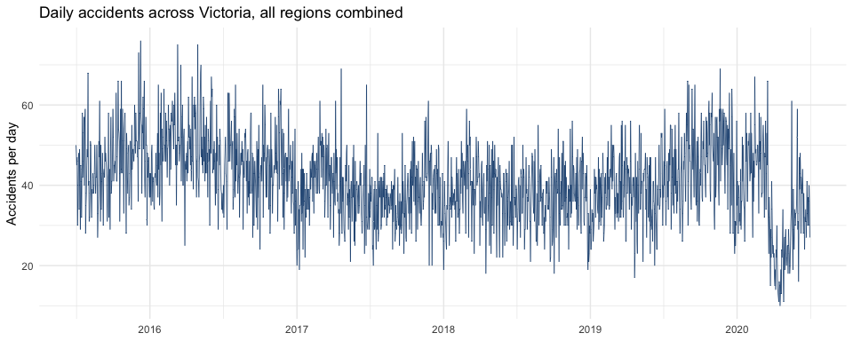
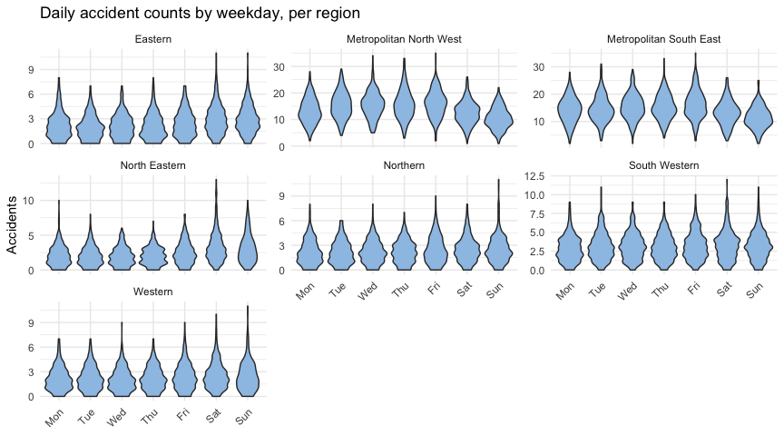
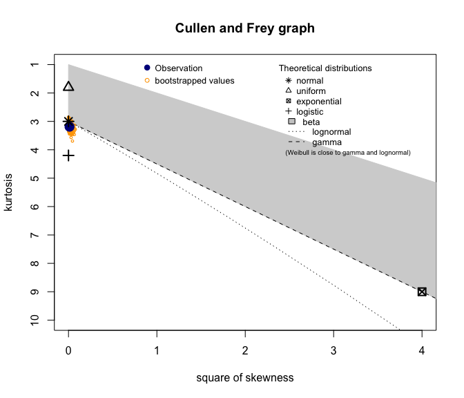

Victorian Car Accident Severity Analysis
================

## Loading and tidying the data

The raw file has a header spanning two rows: one row naming each of
Victoria’s seven road safety regions, and a second row naming the four
severity categories (Fatal, Serious, No Injury, Other) repeated once per
region. That’s a wide format with 28 data columns for a single daily
count. Rather than building each region’s data frame by hand with
`cbind`, which is what the original version of this analysis did across
roughly 80 lines of repetitive code, a single `pivot_longer` reshapes
the whole file at once.

``` r
library(tidyverse)
library(lubridate)
library(fitdistrplus)
library(MASS)
```

``` r
region_names <- c("Eastern", "Metropolitan North West", "Metropolitan South East",
                   "North Eastern", "Northern", "South Western", "Western")
severity_names <- c("Fatal", "Serious", "NoInjury", "Other")

raw <- read_csv("data/car_accidents_victoria.csv", skip = 2, col_names = FALSE, show_col_types = FALSE)
colnames(raw) <- c("Date", paste(rep(region_names, each = 4), rep(severity_names, times = 7), sep = "__"))
raw$Date <- as.Date(raw$Date, format = "%d/%m/%Y")

accidents_long <- raw %>%
  pivot_longer(-Date, names_to = c("Region", "Severity"), names_sep = "__", values_to = "Count")

cat("Rows:", nrow(raw), " Date range:", format(min(raw$Date)), "to", format(max(raw$Date)), "\n")
```

    ## Rows: 1827  Date range: 2015-07-01 to 2020-06-30

## Missing values

The original version of this analysis replaced the literal string
`'N/A'` with `NA` before converting two of the seven regions’ columns to
numeric, and mean-imputed only those two. Checking the raw file directly
shows why that step didn’t do much: the string `"N/A"` doesn’t appear
anywhere in the file at all. The real gaps are blank cells, which
`read_csv` already parses as `NA` on load.

``` r
n_missing <- sum(is.na(accidents_long$Count))
cat("Missing values:", n_missing, "out of", nrow(accidents_long), "cells\n")
```

    ## Missing values: 5 out of 51156 cells

``` r
accidents_long %>% filter(is.na(Count)) %>% count(Region, Severity)
```

    ## # A tibble: 5 × 3
    ##   Region                  Severity     n
    ##   <chr>                   <chr>    <int>
    ## 1 Metropolitan North West NoInjury     1
    ## 2 Metropolitan North West Other        1
    ## 3 North Eastern           Fatal        1
    ## 4 South Western           Other        1
    ## 5 South Western           Serious      1

Five missing cells out of just over 51,000, spread across regions the
original version never checked. Since this is a handful of blank days in
a count series, each is filled with the rounded mean for that region and
severity column, applied consistently across all seven regions rather
than the two the original happened to check.

``` r
accidents_long <- accidents_long %>%
  group_by(Region, Severity) %>%
  mutate(Count = ifelse(is.na(Count), round(mean(Count, na.rm = TRUE)), Count)) %>%
  ungroup()
```

## Daily totals by region

``` r
daily_totals <- accidents_long %>%
  group_by(Date, Region) %>%
  summarise(Total_accidents = sum(Count), .groups = "drop") %>%
  mutate(Weekday = factor(wday(Date, label = TRUE, week_start = 1), ordered = FALSE))
```

``` r
daily_totals %>%
  group_by(Date) %>%
  summarise(Total = sum(Total_accidents)) %>%
  ggplot(aes(x = Date, y = Total)) +
  geom_line(color = "#2E5A87", linewidth = 0.3) +
  labs(title = "Daily accidents across Victoria, all regions combined",
       y = "Accidents per day", x = NULL) +
  theme_minimal()
```

<!-- -->

``` r
daily_totals %>%
  group_by(Region) %>%
  summarise(Average_daily = mean(Total_accidents)) %>%
  ggplot(aes(x = reorder(Region, Average_daily), y = Average_daily)) +
  geom_col(fill = "#5B9BD5") +
  coord_flip() +
  labs(title = "Average daily accidents by region", x = NULL, y = "Average accidents per day") +
  theme_minimal()
```

<!-- -->

Metropolitan South East and Metropolitan North West run well ahead of
the other five regions, which line up with population density rather
than anything specific to road conditions in those areas.

``` r
daily_totals %>%
  ggplot(aes(x = Weekday, y = Total_accidents)) +
  geom_violin(fill = "#9DC3E6") +
  facet_wrap(~Region, scales = "free_y") +
  labs(title = "Daily accident counts by weekday, per region", y = "Accidents", x = NULL) +
  theme_minimal() +
  theme(axis.text.x = element_text(angle = 45, hjust = 1))
```

<!-- -->

## Choosing a distribution for daily accident counts

The original version sampled 200 rows from a single region, fit a
Poisson and a negative binomial to `Total_accidents` for that sample,
correctly noted count data calls for a count distribution, and then,
without explanation, switched to fitting Weibull, gamma, and exponential
distributions (all of which are for continuous data) to an unrelated
column, `Other / 10`. That’s fitting the wrong family of distribution to
a variable that was never the one being investigated. Here, the
comparison stays on `Total_accidents`, statewide, using the full five
years of data rather than a 200-row sample.

``` r
statewide_daily <- daily_totals %>%
  group_by(Date) %>%
  summarise(Total = sum(Total_accidents))

descdist(statewide_daily$Total, boot = 500)
```

<!-- -->

    ## summary statistics
    ## ------
    ## min:  10   max:  76 
    ## median:  41 
    ## mean:  40.89436 
    ## estimated sd:  9.949671 
    ## estimated skewness:  0.1080176 
    ## estimated kurtosis:  3.187843

``` r
pois_fit <- fitdist(statewide_daily$Total, "pois")
nbinom_fit <- fitdist(statewide_daily$Total, "nbinom")

gof <- gofstat(list(pois_fit, nbinom_fit), fitnames = c("Poisson", "Negative binomial"))
gof$aic
```

    ##           Poisson Negative binomial 
    ##          14621.86          13615.87

``` r
denscomp(list(pois_fit, nbinom_fit), legendtext = c("Poisson", "Negative binomial"))
```

<!-- -->

``` r
cat("Mean:", round(mean(statewide_daily$Total), 2), " Variance:", round(var(statewide_daily$Total), 2), "\n")
```

    ## Mean: 40.89  Variance: 99

The variance is well above the mean, which is exactly the condition
(overdispersion) a Poisson distribution can’t represent, since it forces
mean and variance to be equal. The negative binomial fit’s AIC comes in
well below the Poisson fit’s, confirming what the ratio of variance to
mean already suggests.

## Extending the analysis: does the day of the week actually matter?

The original analysis stopped at fitting a distribution to one region’s
sample. Having seen a weekday pattern in the violin plots above, and
knowing the negative binomial is the family that fits better, a natural
next question is whether that weekday effect is real once region
differences are accounted for, rather than just a visual impression from
the plots.

``` r
nb_model <- glm.nb(Total_accidents ~ Weekday + Region, data = daily_totals)
summary(nb_model)
```

    ## 
    ## Call:
    ## glm.nb(formula = Total_accidents ~ Weekday + Region, data = daily_totals, 
    ##     init.theta = 19.38139902, link = log)
    ## 
    ## Deviance Residuals: 
    ##     Min       1Q   Median       3Q      Max  
    ## -3.8974  -0.8960  -0.1529   0.5113   4.2611  
    ## 
    ## Coefficients:
    ##                                Estimate Std. Error z value Pr(>|z|)    
    ## (Intercept)                    0.805021   0.019633  41.004  < 2e-16 ***
    ## WeekdayTue                     0.052745   0.016911   3.119  0.00181 ** 
    ## WeekdayWed                     0.070167   0.016860   4.162 3.16e-05 ***
    ## WeekdayThu                     0.079293   0.016834   4.710 2.48e-06 ***
    ## WeekdayFri                     0.146116   0.016649   8.776  < 2e-16 ***
    ## WeekdaySat                     0.072199   0.016855   4.284 1.84e-05 ***
    ## WeekdaySun                    -0.027921   0.017153  -1.628  0.10357    
    ## RegionMetropolitan North West  1.785270   0.018067  98.816  < 2e-16 ***
    ## RegionMetropolitan South East  1.800692   0.018050  99.761  < 2e-16 ***
    ## RegionNorth Eastern            0.002989   0.022760   0.131  0.89551    
    ## RegionNorthern                -0.036753   0.022964  -1.600  0.10950    
    ## RegionSouth Western            0.275740   0.021518  12.814  < 2e-16 ***
    ## RegionWestern                 -0.047575   0.023021  -2.067  0.03877 *  
    ## ---
    ## Signif. codes:  0 '***' 0.001 '**' 0.01 '*' 0.05 '.' 0.1 ' ' 1
    ## 
    ## (Dispersion parameter for Negative Binomial(19.3814) family taken to be 1)
    ## 
    ##     Null deviance: 55063  on 12788  degrees of freedom
    ## Residual deviance: 14173  on 12776  degrees of freedom
    ## AIC: 56225
    ## 
    ## Number of Fisher Scoring iterations: 1
    ## 
    ## 
    ##               Theta:  19.38 
    ##           Std. Err.:  1.02 
    ## 
    ##  2 x log-likelihood:  -56197.38

``` r
irr <- exp(coef(nb_model))
round(sort(irr[grepl("Weekday", names(irr))], decreasing = TRUE), 3)
```

    ## WeekdayFri WeekdayThu WeekdaySat WeekdayWed WeekdayTue WeekdaySun 
    ##      1.157      1.083      1.075      1.073      1.054      0.972

Each of these is the rate of accidents on that day relative to Monday
(the reference level), holding region constant. Friday runs about 16%
higher than Monday, the largest gap of the week; Sunday is the only day
lower than Monday, though at roughly 3% lower it isn’t a statistically
significant difference. None of this changes which distribution fits
best, but it does turn “the data looks like it varies by weekday” from a
visual impression in the violin plots into an actual estimate of how
much, controlling for the fact that some regions simply carry more
traffic than others.

## Summary

-   Tidying 28 wide columns into one long data frame took a
    `pivot_longer` call instead of building each region by hand; the
    original’s manual approach happened to still work, but only because
    of R’s recycling rules doing something the code didn’t actually ask
    for.
-   The dataset has 5 missing cells in total, none of them the literal
    `"N/A"` string the original code was checking for. All five are now
    imputed consistently, rather than two regions being checked and five
    being skipped silently.
-   Total accidents statewide are overdispersed (variance far exceeds
    the mean), so a negative binomial distribution fits meaningfully
    better than a Poisson one by AIC. The original’s distribution
    comparison was never actually run on the right variable to notice
    this.
-   A negative binomial regression on weekday and region shows a real
    weekday effect that survives controlling for region: Friday runs
    about 16% higher than Monday, and Sunday is the only day at or below
    Monday’s rate. The original stopped short of testing this.
